# Зависимости мода

:::caution Для работы мода `Hollow Engine` требуются такие моды, как:

```mermaid
graph TD;
  HE[HollowEngine]; HC[HollowCore]; KFF[KotlinForForge]; KS[KotlinScript];
  FTBT[FTB Team]; FTBL[FTB Library]; Arc[Architectury];
  
  HE-->|Требует|KS; HE-->|Требует|KFF; HE-->|Требует|HC; HE-->|По выбору|FTBT;
  KS-->|Требует|HC;
  FTBT-->|Требует|FTBL; FTBL-->|ЬТребует|Arc;
```

ℹ️ FTBTeams - не Требуемая библиотека! Устанавливайте, если хотите писать сюжет ℹ️

⚠️ Нужно устанавливать классическую версию HollowCore, без пометки(т.е. не **no-compiler**, **lite**, **original**) ⚠️
:::

---

## Скачать HollowEngine

> [📥 HollowEngine | 1.19.2 | Latest version](https://github.com/HollowHorizon/HollowEngine/releases/tag/lasted-1.19.2)

---

## Скачать HollowCore

> [📥 HollowCore 1.19.2 | Latest version](https://github.com/HollowHorizon/HollowCore/releases/tag/latest-1.19.2)

---

## Скачать KotlinScript

> [📥 KotlinScript 1.0 | 1.19.2 | Latest version](https://github.com/HollowHorizon/KotlinScriptForForge/releases/tag/latest-1.19.2)

---

## Скачать остальное

> Ищите сами 🙂.