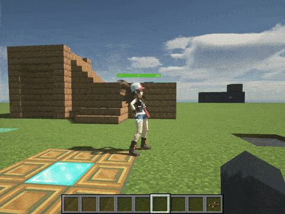

# Действия для НИПа

## Передвижение

### До позиции

:::note НИП будет двигаться до этих координат | Шаблон
```jsx
<npcID> moveToPos { pos(<x>, <y>, <z>) }
```
:::

### До команды

:::note НИП будет двигать до ближайшего игрока в команде | Шаблон
```jsx
<npcID> moveToTeam { team }
```
:::

### До сущности(или НИПа)

:::note НИП будет двигать до другого НИП | Шаблон
```jsx
// Идти до - сущности бесконечно
// Если нужно чтобы НИП сдедовал за другим НИП, то просто укажите npcID другого без {}
<npcID> moveToEntity { <entity> }
```
:::

### До биома

:::note НИП будет двигаться до биома | Шаблон
```jsx
<npcID> moveToBiome{"<biomeID>"}
```
:::


### Бесконечно - До позиции

:::note НИП будет двигаться до цели - бесконечно | Шаблон
```jsx
// Идти до - координат <x>, <y>, <z> бесконечно
<npcID> setMovingPos { pos(<x>, <y>, <z>) } 

// Чтобы перестать идти
<npcID> setMovingPos { null }
```
:::

### Бесконечно - До сущности

:::note НИП будет двигаться до сущности - бесконечно | Шаблон
```jsx
// Идти до - сущности бесконечно
// Если нужно чтобы НИП сдедовал за другим НИП, то просто укажите npcID другого без {}
<npcID> setMovingEntity { entity }

// Чтобы перестать идти
<npcID> setMovingEntity { null }
```
:::

### Бесконечно - До команды

:::note НИП будет двигаться до ближайшего игрока из команды - бесконечно | Шаблон
```jsx
// Идти до - команды бесконечно
<npcID> setMovingTeam { team }

// Чтобы перестать идти
<npcID> setMovingTeam { null }
```
:::


---

## Смотреть

### В сторону позиции

:::note НИП посмотрит на указанные координаты | Шаблон
```jsx
<npcID> lookAtPos { pos(<x>, <y>, <z>) }
```
:::

### В сторону команды

:::note НИП посмотрит на ближайшего игрока в команде | Шаблон
```jsx
<npcID> lookAtTeam { team }
```
:::

### На сущность(или НИП)

:::note НИП посмотрит на другого НИП | Шаблон
```jsx
// Смотреть на - сущность
// Если нужно чтобы НИП смотрел на другого НИП, то просто укажите npcID другого без {}
<npcID> lookAtEntity { <entity> }
```
:::


### Бесконечно - В сторону позиции

:::note НИП Посмотрит на указанные координаты - бесконечно | Шаблон
```jsx
// Смотреть на - координаты <x>, <y>, <z> бесконечно
<npcID> setLookingPos { pos(<x>, <y>, <z>) }

// Чтобы перестать смотреть
<npcID> setMovingTeam { null }
```
:::

### Бесконечно - В сторону команды

:::note НИП посмотрит на ближайшего игрока в команде - бесконечно | Шаблон
```jsx
// Смотреть на - команду
<npcID> setLookingTeam { team }

// Чтобы перестать смотреть
<npcID> setMovingTeam { null }
```
:::

### Бесконечно - В сторону сущности(или НИПа)

:::note НИП будет смотреть на сущность - бесконечно | Шаблон
```jsx
// Смотреть на - сущность бесконечно
// Если нужно чтобы НИП смотрел на другого НИП, то просто укажите npcID другого без {}
<npcID> setLookingEntity { entity }

// Чтобы перестать смотреть
<npcID> setMovingTeam { null }
```
:::


---

# Сказать от лица НИПа

:::note НИП скажет эти слова | Шаблон
```jsx
<npcID> say { "<text>" }
```
:::



---

## Телепортировать НИПа

:::note телепортировать НИПа
```jsx
<npcID>.tpTo{
    pos = pos(x, y, z) // Координаты
    vec = vec(<pitch>, <yaw>) // Поворот взгляда
    dim = dim("<dimenstionID>") // Измерение
    // Если указанное вами измерение относится к Ванилле, то не нужно указывать modID
}
```

> Примеры:
```jsx
<npcID>.tpTo{
    pos = pos(20, -43, -451)
    vec = vec(0f, 0f)
    dim = dim("nether")
    // или к примеру
    dim = dim("copycat:cat_land")
}
```
:::

## Реплей игрока

:::note Воспроизведи свои же действия для НИПов
```jsx
<npcID> replay{"<replayName>.nbt"}
```
:::

## Действия с предметом

### Выкинуть предмет(бросить)

:::note Укажи НИПу, какой предмет нужно выкинуть(бросить)
```jsx
<npcID> dropItem { item("<itemID>") } // На данный момент работает криво, кидает только на Юг. Ждём патча.
```
	
Предмет можно указать лёгким способом. Просто возьмите в основную руку нужный предмет и после пропишите команду `/hollowengine hand`, у вас скопируется данные о предмете вместе с `item`. Вам просто нужно будет вставить это и всё.
:::


### Взять предмет в руку

:::info "`item("<itemID>")` можно получить через: `/hollowengine hand`"
Просто возьмите в руку нужный предмет и пропишите эту команду, после она скопируется и вы можете вставить её туда, где нужно.
:::

:::note Выдать ему определённый предмет в определённую руку через скрипт
```jsx
<npcID> giveLeftHand { item("<itemID>") } // Выдать предмет в левую руку
// or
<npcID> giveRightHand { item("<itemID>") } // Выдать предмет в правую руку
```
`item("<itemID>")` можно получить через: `/hollowengine hand`; Просто возьмите в руку нужный предмет и пропишите эту команду, после она скопируется и вы можете вставить её туда, где нужно.

> Если у НИПа не отображается предметы в руках, то вот помощь -> [Отображение предмета в руках НИПа](../9-Tools/ItemHandVisible)
:::


---

## Взаимодействие с миром

:::note НИП сможет взаимодействовать с миром
```jsx
// Сломать блок в координатах x, y, z
<npcID>.destroyBlock{ pos(x, y, z) }

// Взаимодействие с блоком в координатах x, y. z
<npcID>.useBlock { pos(x, y, z) }
```
:::


---

# Атаковать цель

:::note Укажите кого атаковать
```jsx
<npcID>.setTargetEntity {entity} // Атаковать тущность
```
```jsx
<npcID>.setTargetTeam {team} // Атаковать игрока
```
```jsx
<npcID>.setTargetEntity any_npcID // Атаковать другого НИПа
```
:::


---
Полный используемый скрипт:
```jsx
// Это функция
fun lets() {
	keybind{Keybind.H}
}
//----
team.send{"Ready..."}
lets()

// Базовый НИП
val basic by NPCEntity.creating{ // Создаём нового НИПа
	name = "Женя" // С именем Женя
	showName = false // Отображать ник - нет
	world = "minecraft:overworld" // В измерении Верхний мир
	pos = pos(0.5, -58.0, 0.5) // В позиции x=0.5, y=-58.0, z=0.5
}

// Кастомный НИП
val custom by NPCEntity.creating{ // Создаём нового НИПа
	name = "Катя" // С именем Катя
	model = "hc:models/entity/hilda_regular.glb" // С моделью, которая находится в пути `hollowengine/assets/models/entity/hilda_regular.glb`
	transform = Transform(
		sX = 1.5f, sY = 1.5f, sZ = 1.5f, rY = 180f
	)
	showName = false // Отображать ник - нет
	switchHeadRot = true
	world = "minecraft:overworld" // В измерении Верхний мир
	pos = pos(1.5, -58.0, 1.5) // В позиции x=1.5, y=-58.0, z=1.5
}
lets()

team.send{"До позиции. Анологично с До Сущности или НИПа."}
async{
	camera{
		time = 16.sec
		interpolation = Interpolation.QUAD_IN_OUT
		path = "104d2b4d.nbt"
	}
}
async{
	basic moveToPos{pos(-3, -58, 8)}
}
async{
	custom moveToPos{pos(11, -52, -8)}
}
team.send{"Раздница лишь только в написании."}
lets()

basic setMovingTeam{team}
lets()

custom lookAtPos{pos(3.0, -56.5, -6.19)}
wait{1.sec}
custom lookAtPos{pos(-5.04, -57.31, -2.0)}

custom setLookingTeam{team}

custom lookAtTeam{team}
custom say{"Привет пупсик!"}

custom lookAtTeam{team}
custom dropItem{item("minecraft:spyglass")}
custom say{"Это тебе милый)"}

lets()

basic giveRightHand{item("minecraft:honey_bottle")}
basic giveLeftHand{item("minecraft:redstone_torch")}

basic useBlock{pos(3.49, -57.87, 0.55)}
basic say{"Хоба чё могу!"}

basic say{"Фу ты кринж!"}
basic.setTargetTeam{team}
lets()

basic moveToBiome{"minecraft:plains"}

lets()
basic.despawn()
custom.despawn()
```
