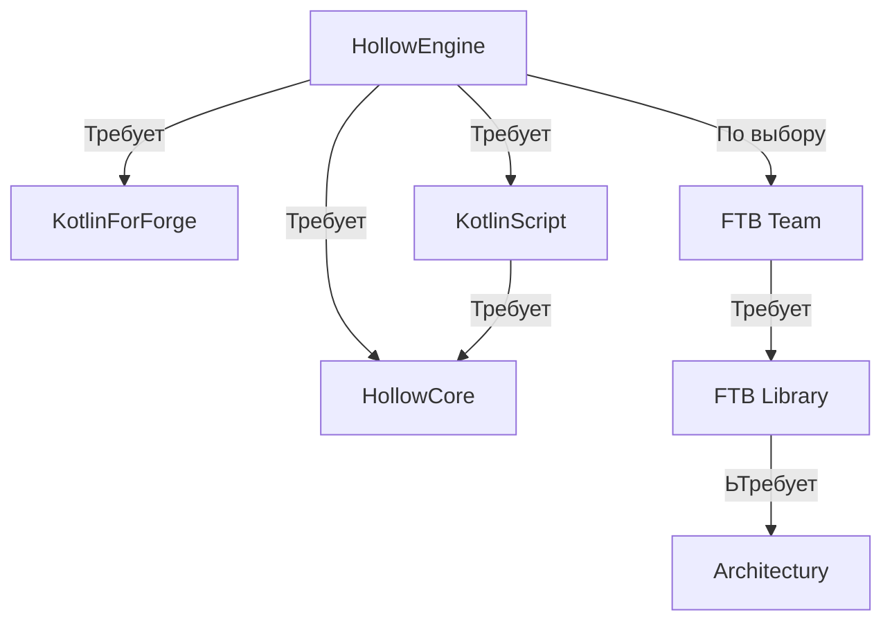

# ↳ ▶ Зависимости мода ⚠️

:::caution 🔷 Для работы мода `Hollow Engine` требуются такие моды, как 🔷:

ℹ️ FTBTeams - не Требуемая библиотека! Устанавливайте, если хотите писать сюжет ℹ️

⚠️ Нужно устанавливать классическую версию HollowCore, без пометки(т.е. не **no-compiler**, **lite**, **original**) ⚠️
:::

---

## 📥 Скачать HollowEngine

> [🔶 HollowEngine | 1.19.2 | Latest version](https://github.com/HollowHorizon/HollowEngine/releases/tag/lasted-1.19.2)

---

## 📥 Скачать HollowCore

> [🔶 HollowCore 1.19.2 | Latest version](https://github.com/HollowHorizon/HollowCore/releases/tag/latest-1.19.2)

---

## 📥 Скачать KotlinScript

> [🔶 KotlinScript 1.0 | 1.19.2 | Latest version](https://github.com/HollowHorizon/KotlinScriptForForge/releases/tag/latest-1.19.2)

---

## 📥 Скачать остальное

> 🔶 [Ищите сами 🙂](https://www.youtube.com/watch?v=dQw4w9WgXcQ)