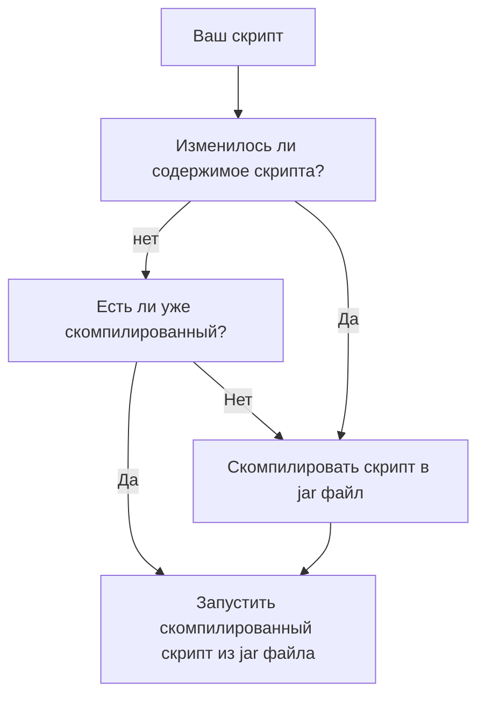

# ↳ ▶ Начинаем ⏰

:::info Начинаем  
- Для начало работы с сюжетом, перейди в раздел(папку) `scripts` и там создай файл: `<name>.<scriptType>.kts`.  
>  Обозначения:  
> - `<name>` - любое имя файла.  
> - `<scriptType>` - [Типы скриптов](./4-scripts-type.mdx)  
:::

:::caution Если ваш скрипт долго запускается
> То это нормально. Он компилируется из скрипта в `jar` и после компиляции запускает скрипт именно из `jar`.  
:::

:::note Структура работы скрипта  

:::

---

## Ошибки в скрипте

:::info Ошибки в скрипте  
> Если вдруг в скрипте есть проблемы, в чат вам напишет, где ошибка (на какой строчке) и в чём ошибка.  
:::

---

## Kotlin (KotlinScript)

:::caution Мод `KotlinScript`  
> - Вообще данный гайд рассказывает о простых вещах. Для более продвинутых действий лучше будет "Начать учить(зубрить) Kotlin".  
> - Базовых вещей может быть достаточно для более менее чего-то.  
> - `HollowEngine` дарует вам возможность использовать ваш скрипт для сюжетов по максимуму.  
> - Контролируйте свой сюжет до мелочей.  
:::
---
