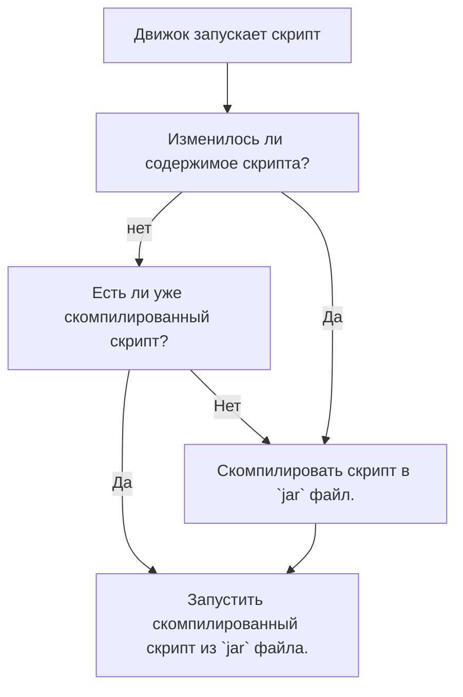

# ↳ Начинаем ⏰

:::info Начинаем  
- Для начало работы с модом, перейди в папку `hollowengine/scripts` (если её нет, то создай) и там создай новый файл по шаблону: `<name>.<script_type>.kts`.
>  Обозначения:  
> - `<name>` - Любое имя файла. (Рекомендуем использовать только английские символы нижнего регистра, цифры и символ `_`)
> - `<script_type>` - [Тип скрипта](./4-scripts-type.mdx).
:::

:::caution Если ваш скрипт долго запускается
> То это нормально. Он компилируется из скрипта в полноценный `jar`. После первой компиляции движок уже запускает скрипт из `jar` моментально.
> Если же скрипт грузится более двух минут, то попробуйте перезайти в игру и попробовать снова, если это не поможет, то сообщите об этом разработчикам.
:::

:::note Схема работы скрипта

:::

---

## Ошибки в скрипте

:::info Ошибки в скрипте  
> Если вдруг в скрипте есть проблемы, в чат (или логи) вам напишет, где **на какой строчке ошибка**, а также описание самой ошибки. Не стоит сразу, не читая скидывать это разработчикам, **скорее всего ошибка в вашем скрипте**, а не самом моде. Разработчикам обидно, когда им скидывают элементарные ошибки, связанные с вашим незнанием языка, а не самим модом 😢
:::

---

## Kotlin (KotlinScript)

:::caution Мод `KotlinScript`  
> - Вообще данный гайд рассказывает о простых вещах. Для более продвинутых действий лучше будет "Начать изучать (зубрить) [Kotlin](https://kotlinlang.ru/)".
> - Базовых вещей может быть достаточно для более менее чего-то.  
> - `HollowEngine` дарует вам возможность использовать ваш скрипт для сюжетов по максимуму.  
> - Контролируйте свой сюжет до мелочей.  
:::
---
