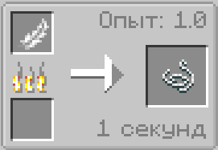

# Коптильня

:::note Рецепты крафтов для Коптильня
Вы можете создавать и изменять рецепты крафта для Коптильня
:::

---

:::warning Внимание
Всё что указывается в `[]` скобках, это тоже что и `<>`, то с условием что это - обязательное значение!
:::

---

## Удалить рецепт

:::info "Удалить существующий рецепт предмета | Шаблон"

```kts
Smoker.removeRecipe(
	item("[<itemID>]") // Предмет на выходе (результат крафта)
)
```

:::

## Добавить рецепт

:::info "Добавить новый рецепт предмета | Шаблон"

```kts
Smoker.addRecipe(
	item("[<itemID_Output>]"), // Предмет на выходе (результат крафта)
	item("[<itemID_Input>]"), // Предмет входа (ингридиент)
	"<group>", // хз
	<xp>, // Кол-во получаемого опыта. Float
	[<time>]) // Время готовки в тиках. Int
```

Пример скрипта крафта:

```kts
Smoker.addRecipe(
	item("minecraft:string"),
	item("minecraft:feather"),
	"",
	1f,
	20
)
```



:::

---
