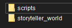

# First Launch

:::info After the first launch of the game with the mod...
> A **New Folder** named `hollowengine` will appear in the game directory.
:::

---

:::note Inside this folder, there will be other folders...
> ```txt
> * hollowengine
> |- scripts
> \- storyteller_world
> ```
> 
>
> ---
>
> In `scripts`, all your scripts will be stored. Additionally, for your convenience, you can create new sections (folders) and subsections (subfolders) there.
>
> `storyteller_world` contains a completely separate world.
:::

---
