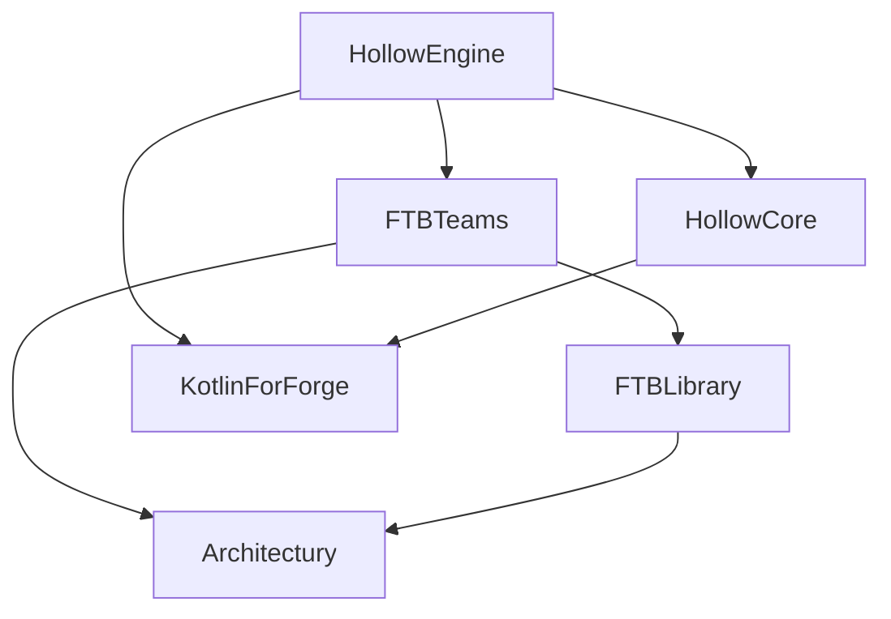

# Mod Dependencies

:::caution The mod `Hollow Engine` requires the following mods to function:

ℹ️ FTBTeams is Optional library! Install, if you want to make a story ℹ️

⚠️ HollowCore needs classic version, without marker(i.e **no-compiler**, **lite**, **original**) ⚠️
:::

---
