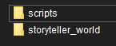

# Новая папка

При первом запуске мода, в директории появиться новая папка с именем `hollowengine`.

В ней будут 2 новые папки:
> - `scripts`
> - `storyteller-world`

***

## Папка `scripts`

> В ней вы будете хранить все свои скрипты. Так же в ней вы можете создать ещё нескольпо папок с под-папками для своего удобства.

***

## Папка `storyteller-world`

> В этой папке хранятся данные от измерения `StoryTeller`.

***