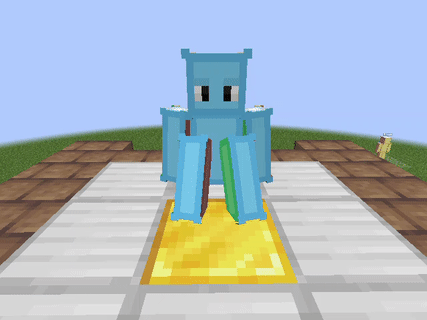

# Анимации NPC

***

## Стандартные анимации

:::tip Стандартные анимации
Это те анимации, которые уже заданы в движке и вам не нужно прописывать им условия. Достаточно будет просто назвать их правильно.

> - `idle` - Анимация, когда NPC - стоит.
> - `walk` - Анимация, когда NPC - ходит.
> - `sit` - Анимация, когда NPC - сидит (к примеру на коне).
> - `death` - Воспроизводиться, когда NPC - умирает.

Но важно помнить: Эти анимации нельзя предустановить - вручную. Так что, если у вас есть анимации с названиями: `idle-1`, `idle-2`, то использоваться будет только первая.
:::

***

## Кастомные анимации

:::note Чтобы воспроизвести другие анимации...
Используй это | Макет скрипта
```jsx
<npcID>.play("<animName>"), <priority>, <playMode>)
```
Обозначения:
> - `<npcID>` - Уникальное имя NPC для скрипта. Через него ты обращаешься к конкретному NPC.
> - `<animName>` - Название анимации которая должна быть вшита в модель `GlTF`. Название может быть любым.
> - `<priority>` - [не обязательно] | Устанавливает приоритет к определённой анимации от остальных. Чем выше - тем лучше применяется.
> - `<playMode>` - Режим воспроизведения анимации, начинается с `playType=PlayType.*`:
>   - `ONCE` - Проигрывает анимацию 1 раз, после автоматически выкл.
>   - `LOOPED` - Проигрывает анимацию зациклено. Требует выкл анимации - вручную.
>   - `LAST_FRAME` - Проигрывает анимацию 1 раз, после в конце замирает. Требует выкл анимации - вручную.
>   - `REVERSED` - Проигрывает анимацию вперёд - назад, после автоматически выкл.

:::

***

Пример скрипта | Можете скопировать для проверки
```jsx
vitalik.play("addAnim.waving", priority=5f, playType=PlayType.ONCE)
```


`В демонстрации используется Своя модель. Вы не сможете её никак использовать т.к. в файлах нет данной модели.`

***

:::note Остановить воспроизведение анимации
Для остановки воспроизведения нужно следующее | Макет скрипта
```jsx
<npcID>.stop("<Active_animName>")
```
Обозначения:
> - `<Active_animName>` - Название активной на данный момент анимации,

***

Пример скрипта | Можешь скопировать для проверки
```jsx
vitalik.stop("anim.sit-loop")
```



`В демонстрации используется Своя модель. Вы не сможете её никак использовать т.к. в файлах нет данной модели.`