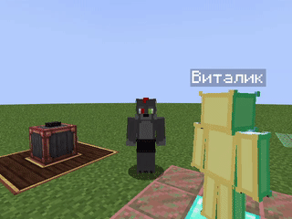

# Задача: Взгляд

:::note Чтобы указать, куда надо посмотреть NPC...
Используй это | Макет скрипта
```jsx
<npcID>.makeTask{
    look.at(<parametr>).<taskMode>
    }
```
Обозначения:
> - `<npcID>` - Уникальное имя NPC для скрипта. Через него ты обращаешься к конкретному NPC.
> - `<parametr>` - Параметр, для указания конкретного случая:
>   - `<any_npcID>` - Укажите любого другого NPC, и тогда он посмотрит на него.
>   - `<x>, <y>, <z>` - Укажите координаты того, куда нужно будет посмотреть NPC.
>   - `<team>` - Укажите команду, и тогда NPC посмотрит на главного в команде. 
>   - `team.getPlayer("<player>").mcPlayer!!` - Замените `<player>` на ник игрока на которого NPC должен посмотреть.
> - `<taskMode>` - режимы выполнения задач. Виды:
>   - `await()` - Скрипт не пойдёт дальше, пока поставленные задачи **не будет выполнена**.
>   - `async()` - Скрипт будет идти дальше, **игнорируя выполненную задачу**.
:::

***

Пример скрипта [Указываются координаты] | Можете скопировать для проверки.
```jsx
vitalik.makeTask{
    look.at(3, -57, -7).awati()
    }
```


`В демонстрации используется [Своя модель]. Вы не сможете её никак использовать т.к. в файлах нет данной модели.`

***
Пример скрипта [Указывается другой NPC] | Можете скопировать для проверки
```jsx
vitalik.makeTask{
    look.at(jenya).awati()
    }
```


`error-text`

***

Пример скрипта [Указав НИК игрока] | Можете скопировать для проверки, но замените знач `<me>` на ник игрока
```jsx
vitalik.makeTask{
    look.at(team.getPlayer("<me>").mcPlayer!!.awati()
    }
```



`В демонстрации используется [Своя модель]. Вы не сможете её никак использовать т.к. в файлах нет данной модели.`
***