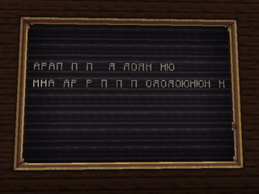

# [Not Working] | Чёрный экран

:::note Этот скрипт...
Поможет вам вкл чёрный экран, на некоторое время | Макет скрипта
```jsx
makeTransition("<displayText>", <count>f) {
    <addScripts>
    }
```
Обозначения:
> - `<displayText>` - Ваш текст, который будет виден при чёрном экране.
> - `<count>f` - Время (в секундах) отображения чёрного экрана.
> - `<addScripts>` - Здесь в можете записать скрипты которые будут выполняться при чёрном экране.

***

Пример скрипта | Not Working
```jsx
makeTransition("Алмаз", 5f) {
    execute("/tp <me> ~ ~100 ~")
    }
```



:::

***