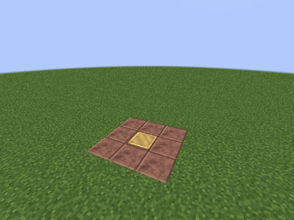

# /`<command>`

:::caution Перед началом
Импортируй эту библиотеку | Просто вставь это в начале скрипта
```jsx
import ru.hollowhorizon.hollowengine.common.scripting.story.extensions.*
```
:::

:::note Для использования обычных комманд...
К примеру `/setblock ~ ~ ~ minecraft:stone`, используй это | Макет скрипта
```jsx
execute("/<command>")
```
Обозначения:
> - `<command>` - Любая существующая в игре команда: `setblock, kill, give, ...`.
:::

***

Пример скрипта | Можешь скопировать для тестирования
```jsx
execute("/setblock 55 -58 -30 minecraft:scaffolding")
wait(1f)
execute("/setblock 55 -57 -30 minecraft:flower_pot")
wait(1f)
execute("/setblock 55 -57 -30 minecraft:potted_flowering_azalea_bush")
wait(1f)
execute("/setblock 55 -56 -30 minecraft:flowering_azalea_leaves")
wait(1f)
execute("/setblock 55 -55 -30 minecraft:moss_carpet")
```



***