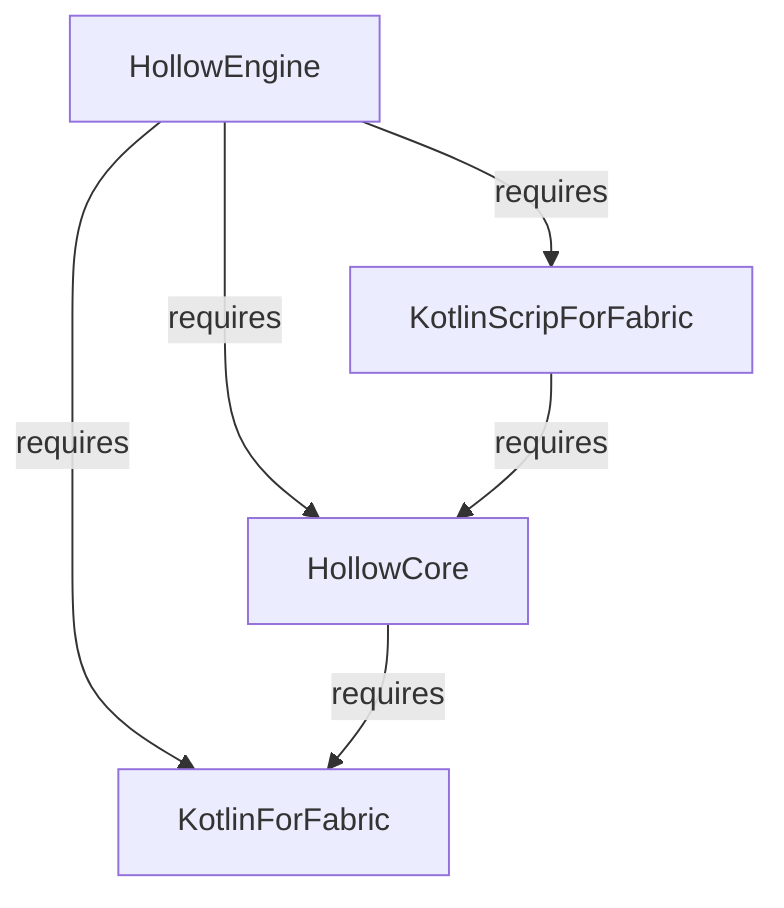

:::warning Only for sponsors and testers!
This page can be changed in future, so don`t think, now - is the final result.
:::

# Mod dependencies

---

 

:::info Mod dependencies in graph

```mermaid
graph TD;

  HE[HollowEngine]; HC[HollowCore]; KFF[KotlinForFabric]; KSFF[KotlinScripForFabric];
  
  HE-->|requires|HC
  HE-->|requires|KFF
  HE-->|requires|KSFF
  
  KSFF-->|requires|HC
  
  HC-->|requires|KFF
```
:::

