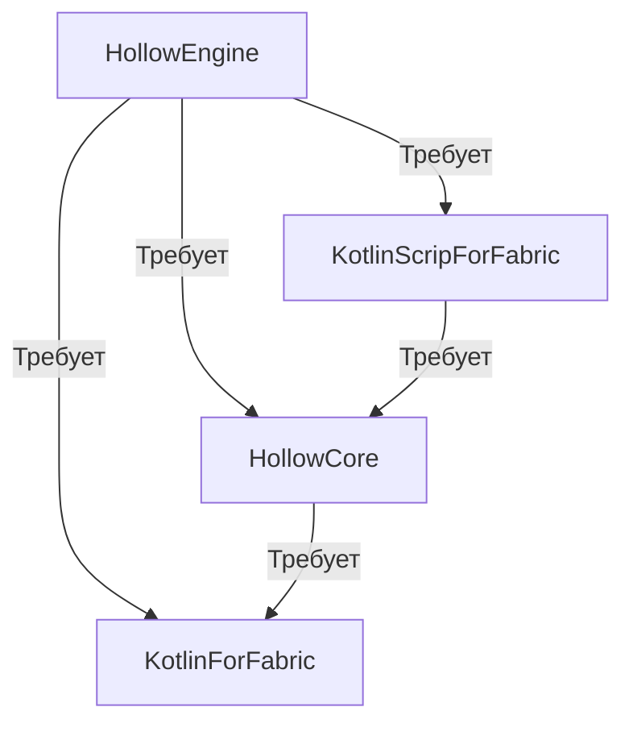

:::warning Только для бустеров и тестеров
Данная страница может изменится в будущем, так что не думайте что то как оно сейчас - будет всегда.
:::

# Зависимости мода

---

 

:::info Зависимости мода в виде графика

:::

