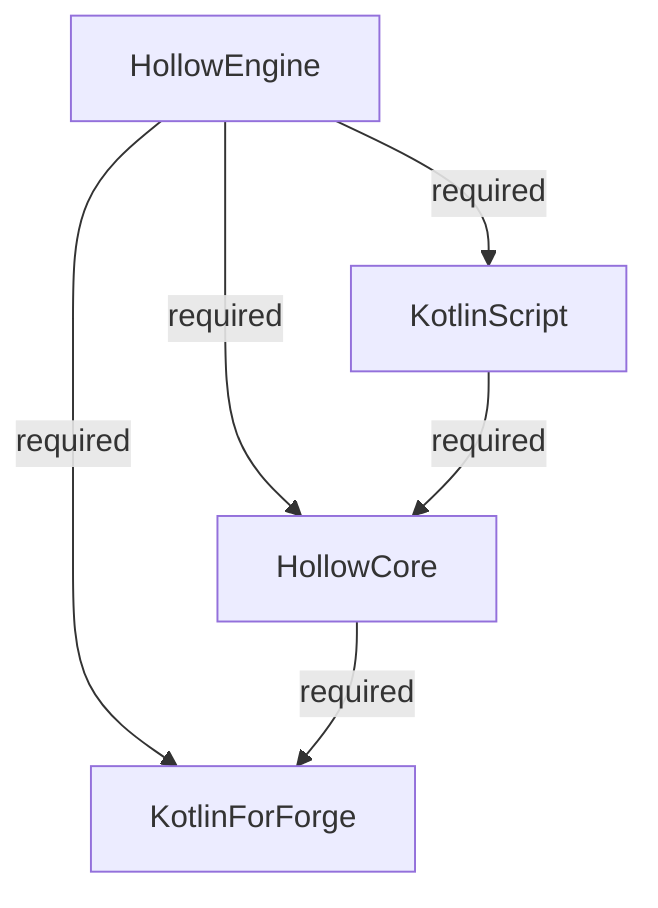

import ToBeta from '@site/src/components/NewDocs.js';

<ToBeta url='welcome' />

:::caution 🔷 The `Hollow Engine` mod requires mods such as 🔷:

⚠️ To write scripts, you must install the full version of KotlinScript (without labels like **no-compiler**, **lite**, **original**, etc.). ⚠️
:::

---

# 📥 Download HollowEngine

> [🔶 HollowEngine | 1.19.2 | Latest version](https://github.com/HollowHorizon/HollowEngine/releases/tag/lasted-1.19.2)

---

# 📥 Download HollowCore

> [🔶 HollowCore | 1.19.2 | Latest version](https://github.com/HollowHorizon/HollowCore/releases/tag/latest-1.19.2)

---

# 📥 Download KotlinScript For Forge

> [🔶 KSFF | 1.19.2 | Latest version](https://github.com/HollowHorizon/KotlinScriptForForge/releases/tag/latest-1.19.2)
> [🔶 KSFF | 1.19.2 | Modrinth version](https://modrinth.com/mod/ksff)
