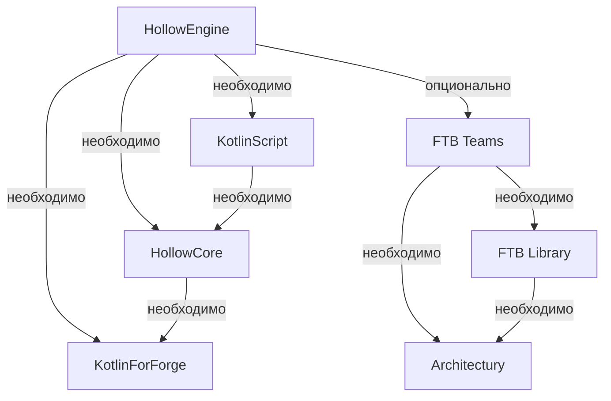

:::caution 🔷 Для работы мода `Hollow Engine` требуются такие моды, как 🔷:

ℹ️ FTBTeams - опциональная библиотека! Устанавливайте, если хотите писать сюжет ℹ️

⚠️ Для написания скриптов нужно устанавливать полную версию KotlinScript (без пометкок вроде: **no-compiler**, **lite**, **original** и т.п.) ⚠️
:::

---

# 📥 Скачать HollowEngine

> [🔶 HollowEngine | 1.19.2 | Latest version](https://github.com/HollowHorizon/HollowEngine/releases/tag/lasted-1.19.2)

---

# 📥 Скачать HollowCore

> [🔶 HollowCore | 1.19.2 | Latest version](https://github.com/HollowHorizon/HollowCore/releases/tag/latest-1.19.2)

---

# 📥 Скачать KotlinScript For Forge

> [🔶 KSFF | 1.19.2 | Latest version](https://github.com/HollowHorizon/KotlinScriptForForge/releases/tag/latest-1.19.2)
> [🔶 KSFF | 1.19.2 | Modrinth version](https://modrinth.com/mod/ksff)

---

# 📥 Скачать FTB Teams

> [🔶 FTB Teams | 1.19.2 | Latest version](https://www.curseforge.com/minecraft/mc-mods/ftb-teams-forge/files/4611938)

---

# 📥 Скачать FTB Library

> [🔶 FTB Library | 1.19.2 | Latest version](https://www.curseforge.com/minecraft/mc-mods/ftb-library-forge/files/4661834)

---

# 📥 Скачать Architectury

> [🔶 Architectury | 1.19.2 | Latest version](https://www.curseforge.com/minecraft/mc-mods/architectury-api/files/5137942)
