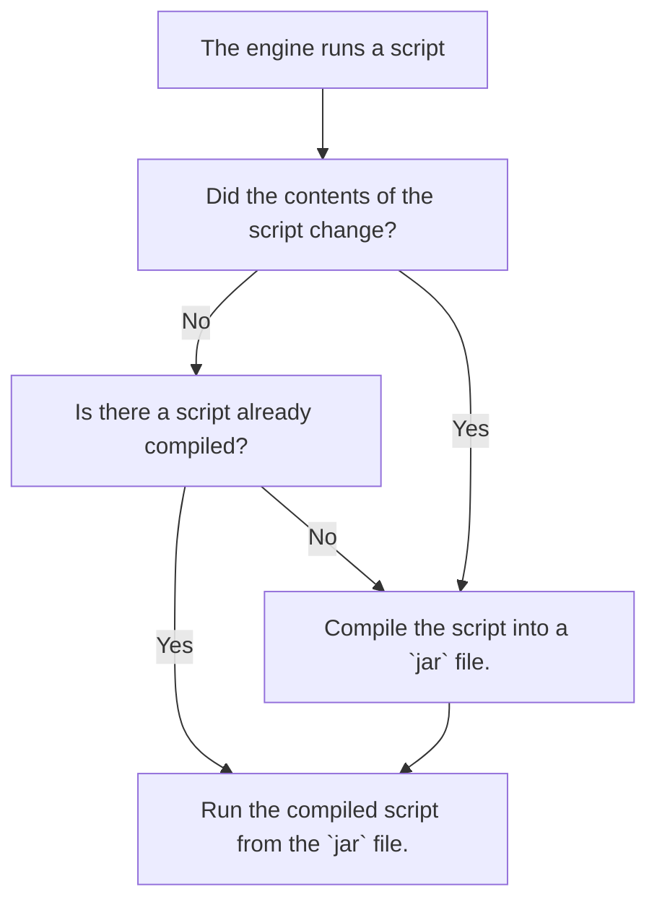

:::info
- To start working with the mod, go to the `hollowengine/scripts` folder (if it does not exist, then create it) and there create a new file according to the template: `<name>.<script_type>.kts`.
>  Обозначения:  
> - `<name>` - Any file name. (We recommend using only lower case English characters, numbers and the `_` symbol)
> - `<script_type>` - [Script type](./4-scripts-type.mdx).
:::

:::caution If your script takes a long time to run
> That's fine. It is compiled from a script into a full-fledged `jar`. After the first compilation, the engine runs the script from `jar` instantly.
> If the script takes more than two minutes to load, try to restart the game and try again, if it doesn't help, report it to the developers.
:::

:::note Schematic of the script

:::

---

## Errors in script

:::info Errors in a script
> If there are problems in the script, the chat (or logs) will tell you where **on what line the error is**, as well as a description of the error itself. You should not immediately, without reading it, throw it to the developers, **most likely the error is in your script**, not in the mod itself. Developers are offended when they are thrown elementary errors related to your ignorance of the language, not the mod itself 😢
:::

---

## Kotlin (KotlinScript)

:::caution Mod `KotlinScript`
> - In general, this guide is about simple things. For more advanced actions it would be better to "Start learning [Kotlin](https://kotlinlang.ru/)".
> - Basic stuff may be enough for more or less anything.  
> - `HollowEngine` gives you the ability to use your script for plots to the max.  
> - Control your plot down to the last detail.  
:::
---
