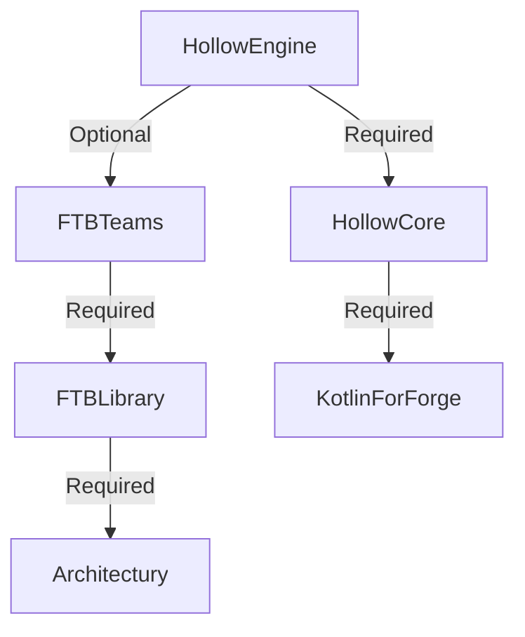

# Mod Dependencies

What I need?

:::caution The mod `Hollow Engine` requires the following mods to function:

ℹ️ FTBTeams is optional library! Install, if you want to make a story ℹ️

ℹ️Photon is optional library! Install, if you want to make special effects for NPC (Required FTBTeams for creating NPCs) ℹ️

⚠️ HollowCore needs classic version, without marker(i.e. **no-compiler**, **lite**, **original**) ⚠️
:::

---
