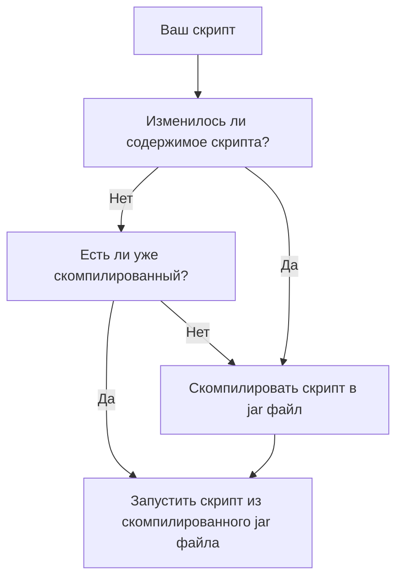

# Начинаем

:::info
Для начало работы с сюжетом, перейди в раздел(папку) `scripts` и там создай файл: `<name>.<scriptType>.kts`.
> Обозначения:
> - `<name>` - любое имя файла.
> - `<scriptType>` - [Типы скриптов](./scripts-type)
:::

:::caution Если ваш скрипт долго запускается...
> То это нормально. Он компилируется из скрипта в `jar` и после компиляции запускает скрипт именно из `jar`.
:::

:::note Структура работы скрипта

:::

---
