:::caution 🔷 Для работы мода `Hollow Engine` требуются такие моды, как 🔷:

```mermaid
graph TD;
  HE[HollowEngine]; HC[HollowCore]; KFF[KotlinForForge]; KS[KotlinScript];
  
  HE-->|необходимо|KS;
  HE-->|необходимо|KFF;
  HE-->|необходимо|HC;

  KS-->|необходимо|HC;

  HC-->|необходимо|KFF;
```

⚠️ Для написания скриптов нужно устанавливать полную версию KotlinScript (без пометок вроде: **no-compiler**, **lite**, **original** и т.п.) ⚠️
:::

---

# 📥 Скачать HollowEngine

> [🔶 HollowEngine | 1.19.2 | Latest version](https://github.com/HollowHorizon/HollowEngine/releases/tag/lasted-1.19.2)

---

# 📥 Скачать HollowCore

> [🔶 HollowCore | 1.19.2 | Latest version](https://github.com/HollowHorizon/HollowCore/releases/tag/latest-1.19.2)

---

# 📥 Скачать KotlinScript For Forge

> [🔶 KSFF | 1.19.2 | Latest version](https://github.com/HollowHorizon/KotlinScriptForForge/releases/tag/latest-1.19.2)
> [🔶 KSFF | 1.19.2 | Modrinth version](https://modrinth.com/mod/ksff)

# 📥 Скачать Kotlin For Forge

> [🔶 KSFF | 1.19.2 | 3.12.0](https://www.curseforge.com/minecraft/mc-mods/kotlin-for-forge/files/4513187)
