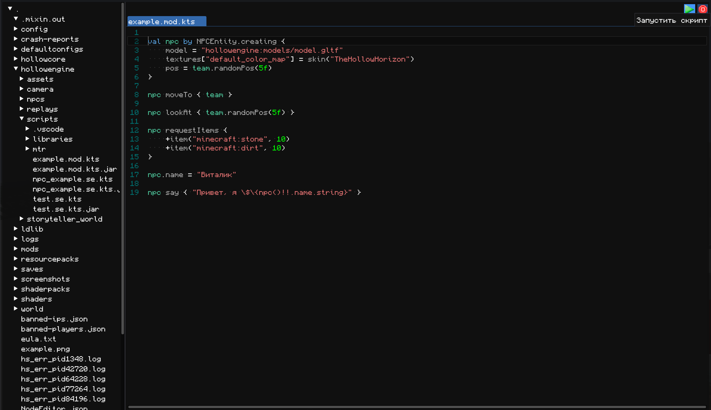

Для написания скриптов Вы можете использовать что угодно, VSCode, SublimeText 4, Intellij IDEA, да хоть блокнот. Но если вам лень со всем этим морочиться, то рекомендуем попробовать встроенную среду разработки, чтобы её открыть нажмите на шестерёнку в меню паузы игры.

Перед вами откроется простой интерфейс имеющий слева папку игры, а справа пространство с редактором кода.
При написании скриптов справа вверху появятся кнопки для запуска и остановки скрипта. Запуская скрипт через этот редактор, при наличии ошибок вам сразу подсветят красным строчки и описание этих ошибок!

Примечание: Редактор пока в стадии доработки, не рекомендуется открывать им другие файлы, кроме скриптов, иначе вы рискуете повредить их содержимое.