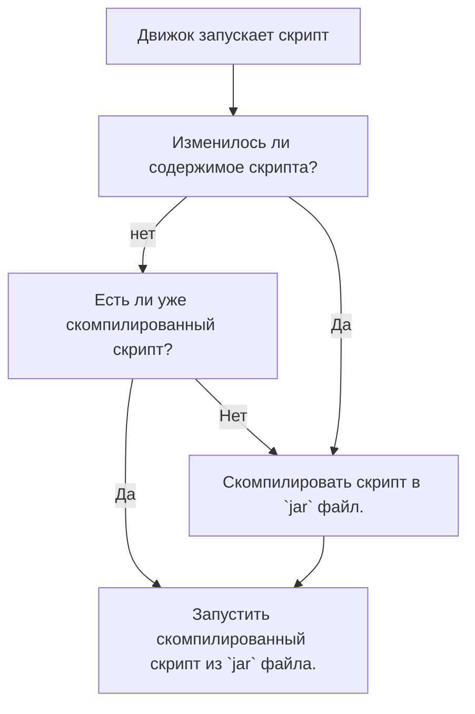

import ToBeta from '@site/src/components/NewDocs.js';

<ToBeta url='welcome' />

:::info Начинаем
- Для начала работы с модом, откройте или создайте папку `hollowengine/scripts`. Создайте там файл по следующему шаблону: `<name>.<script_type>.kts`.
>  Обозначения:
> - `<name>` - Любое имя файла. (Рекомендуем использовать только английские символы нижнего регистра, цифры и символ `_`)
> - `<script_type>` - [Тип скрипта](./4-scripts-type.mdx).
:::

:::caution Предупреждение
> Если ваш скрипт долго запускается, то это нормально. Он компилируется из скрипта в исполняемый файл `.jar`. После первой компиляции движок уже запускает скрипт из `jar` моментально.
> Если же скрипт грузится более двух минут, то попробуйте перезайти в игру и попробовать снова, если это не поможет, то сообщите об этом разработчикам.
:::

:::note Схема работы скрипта

:::

---

## Ошибки в скрипте

:::info Ошибки в скрипте
> Если вдруг в скрипте есть проблемы, то не спешите сразу писать разработчикам, посмотрите внимательно в чат или логи, вам напишет, **на какой строчке ошибка**, а также в чём она заключается. Попробуйте также загуглить ошибку и посмотреть схожие проблемы у других разработчиков, вполне вероятно Вы справитесь сами. Мы верим в вас!
:::

---

## Kotlin (KotlinScript)

:::caution Мод `KotlinScript`
> - Вообще данный гайд рассказывает о простых вещах. Для более продвинутых действий лучше будет "Начать изучать [Kotlin](https://kotlinlang.ru/)".
> - Базовых знаний программирования и структур данных в целом достаточно чтобы работать с модом. Разве что советуем подробнее ознакомиться с Лямбда-выражениями.
:::
---