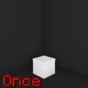
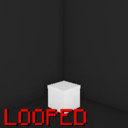
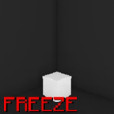
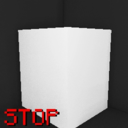

import Tabs from '@theme/Tabs';
import TabItem from '@theme/TabItem';
import styles from '@site/src/css/styles.module.css';

:::note Тип воспроизведения анимации

<Tabs>
<TabItem value="playOnce" label="Один раз" attributes={{className: styles.def}}>

```kts
<npcID> playOnce { "<animationName>" }
```
> Проигрывает анимацию 1 раз, после автоматически выкл



</TabItem>
<TabItem value="playLooped" label="В цикле" attributes={{className: styles.def}}>

```kts
<npcID> playLooped { "<animationName>" }
```
> Проигрывает анимацию в цикле (бесконечно). Будет проигрываться пока не будет остановлена принудительно  



</TabItem>
<TabItem value="playFreeze" label="Заморозить" attributes={{className: styles.def}}>

```kts 
<npcID> playFreeze { "<animationName>" }
```
> Проигрывает анимацию до конца, после замирает на последнем кадре  



</TabItem>
<TabItem value="playStop" label="Остановить анимацию" attributes={{className: styles.def}}>

```kts
<npcID> stop { "<active_animationName>" }
```
> Проигрывает анимацию в цикле (бесконечно) вперёд-назад  



</TabItem>
<TabItem value="playSetting" label="Расширенная настройка" attributes={{className: styles.def}}>

```kts
<npcID> play {
    animation = "<animationName>" // Название анимации
    // highlight-start
    layerMode = LayerMode.<modeType> // Режим проигрывания. Есть:
    // - LayerMode.ADD - Умножить
    // - LayerMode.OVERWRITE - Перезаписать
    // highlight-end
    
    // highlight-next-line
    playType = PlayMode.<playType> // Как проигрывать анимацию. Есть:
    // highlight-next-line
    // - PlayMode.ONCE - 1 раз
    // highlight-next-line
    // - PlayMode.LOOPED - в цикле
    // highlight-next-line
    // - PlayMode.LAST_FRAME - Зависнуть на последнем кадре
    // highlight-next-line
    // - PlayMode.REVERSED - в цикле вперёд и обратно
    
    speed = <float> // Скорость анимации
}
```
> - Если нужна более детальная настройка  
> - Можно настроить:  
>   - Какую анимацию воспроизводить  
>   - Слой анимации (т.е. как запущенная анимация будет работать с прошлыми активными)  
>   - В каком режиме проигрывать анимацию  
>   - Скорость анимации

</TabItem>
</Tabs>

:::

---

## Примеры

```kts
jeka playOnce{"smart"}
jeka playLooped{"running_stand"}
jeka playFreeze{"scream_shook"}

jeka play{
    animation = "JjRfrnc"
    layerMode = LayerMode.ADD
    playType = PlayMode.LAST_FRAME
    speed = 1.2f
}
```