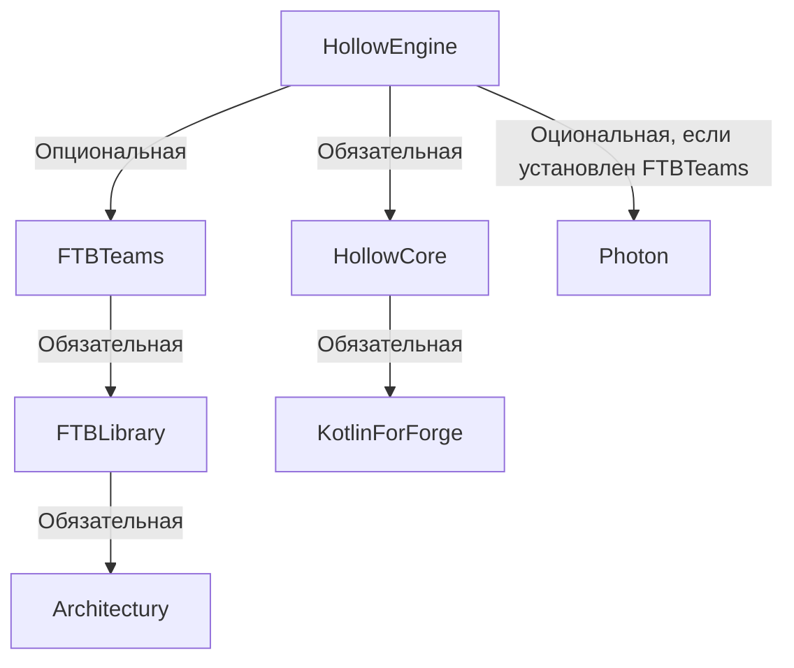

# Зависимости мода

:::caution Для работы мода `Hollow Engine` требуются такие моды, как:

ℹ️ FTBTeams - не обязательная библиотека! Устанавливайте, если хотите писать сюжет ℹ️

ℹ️ Photon - не обязательная библиотека! Устанавливайте, если хотите делать спецэффекты для NPC (Требуется FTBTeams, для создания NPC) ℹ️

⚠️ Нужно устанавливать классическую версию HollowCore, без пометки(т.е. не **no-compiler**, **lite**, **original**) ⚠️
:::

---
