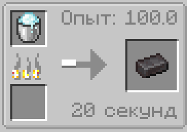

# Плавильня

:::note Рецепты крафтов для Плавильни
Вы можете создавать и изменять рецепты крафта для Пплавильни
:::

---

:::warning Внимание
Всё что указывается в `[]` скобках, это тоже что и `<>`, то с условием что это - обязательное значение!
:::

---

## Удалить рецепт

:::info Удалить существущий рецепт предмета | Шаблон

```jsx
BlastFurnace.removeRecipe(
	item("[<itemID>]") // Предмет на выходе (результат крафта)
)
```

:::

## Добавить рецепт

:::info Добавить новый рецепт предмета | Шаблон

```jsx
BlastFurnace.addRecipe(
	item("[<itemID_Output>]"), // Предмет на выходе (результат крафта)
	item("[<itemID_Input>]"), // Предмет входа (ингридиент)
	"<group>", // хз
	<xp>, // Кол-во получаемого опыта. Float
	[<time>]) // Время готовки в тиках. Int
```

Пример скрипта крафта:

```jsx
BlastFurnace.addRecipe(
	item("minecraft:netherite_ingot"),
	item("minecraft:powder_snow_bucket"),
	"",
	100f,
	400
)
```



:::

---