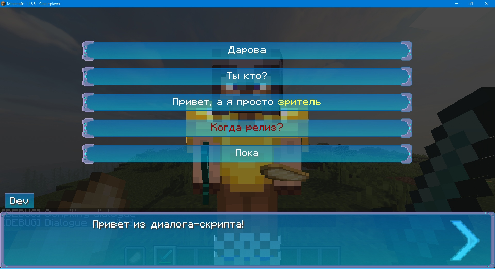

# 2.0 | Диалоги | Начало

## Файл диалога

Прежде чем переходить к диалогам, советую ознакомиться со [скриптовым движком](./introducing).

Об расширениях скриптов, вы можете узнать [здесь](./scriptfiles)

## Создание персонажа

### Немного о HDCharacter

HDCharacter - класс для создания персонажей для диалогов

Имеет два конструктора:
- `HDCharacter(type)` 
- `HDCharacter(location, characterName, nbt)`

О конструкторах:

| Конструктор |  Переменные   |                  Описание                  | Значения по умолчанию | Пример                                                                               |     Тип      |
|:-----------:|:-------------:|:------------------------------------------:|:---------------------:|:-------------------------------------------------------------------------------------|:------------:|
|   Первый    |     type      |           Устанавливает сущность           |                       | MyLivingEntity(<br/>Minecraft.getInstance().level, <br/>MyEntityTypes.MyLiving<br/>) | Обязательная |
|             |               |                                            |                       |                                                                                      |              |
|   Второй    |   location    |      Устанавливает сущность через id       |                       | "minecraft:villager"                                                                 | Обязательная |
|   Второй    | characterName | Устанавливает отображаемое имя у персонажа |      "%default%"      | "Эрик"                                                                               | Опциональная |
|   Второй    |      nbt      |      Устанавливает NBT для персонажа       |          ""           | "{VillagerData:{profession:farmer,level:2,type:savanna}}"                            | Опциональная |

### Создание персонажа
```kotlin
val vitalik = HDCharacter("minecraft:villager", "Виталик", "{VillagerData:{profession:farmer,level:2,type:savanna}}")
```

### Character phrases
Теперь мы можем заставить персонажа говорить:
```kotlin
vitalik say "Привет, я Виталик, я захвачу мир!"
```
Ну и готово, теперь вы можете писать диалоги с персонажами... Но чего-то не хватает?

## Сюжетный выбор
Нехватает выбора, а делается он очень просто:
```kotlin
choice(
    "Нет, Виталик, я буду защищать этот мир" to {
        vitalik say "Я буду бороться за свои кринжовые фразы"
    },
    "Нет, Виталик, я захвачу этот мир первым!" to {
        vitalik say "Ну блин("
    }
)
```

## Персонаж игрока и его фразы
В скрипт уже вшита переменная `player`, так что вы можете сразу использовать её:
```kotlin
player say "Я и-и-игрок!"
```

## Пример
В качестве примера можете создать файл диалога и вставить туда этот текст:
```kotlin
val vitalik = HDCharacter("minecraft:villager", "Виталик", "{VillagerData:{profession:farmer,level:2,type:savanna}}")

vitalik say "Добро пожаловать в диалог HollowStory!"
vitalik say "Я Виталик, меня придумал BarMaxx!"

choice(
    "Что ты умеешь?" to {
        vitalik say "Я умею считать до 100!"
        for(i in 1..100) vitalik say "$i"
        player say "Пон."
    },
    "А я ${player.name.string}" to {
        vitalik say "Круто, а что ты умеешь?"

        choice(
            "Я умею писать диалоги" to {
                vitalik say "А я нет, научи, пж, пж, пж, пж, пж, пж!"

                player say "А вот хрен те, иди исходный код читай"

                vitalik say "Хорошо, спасибо"
            }
        )

        player say "Надо что-то сказать, но я не знаю что..."
    }
)

say("", "И жили они долго и долго!")
say("${player.name.string} и Виталик", "Кто это сказал?!")
```

Пример того, как диалоги выглядят в игре (все текстуры и цвета можно настроить в скрипте):



## Запуск диалога

Для запуска диалога введите: `/hollowengine open-dialogue dialogueid.hsd.kts`.
Если после названия указать имя игрока или тег типа `@a`, то диалог запустится у конкретного игрока/группы.