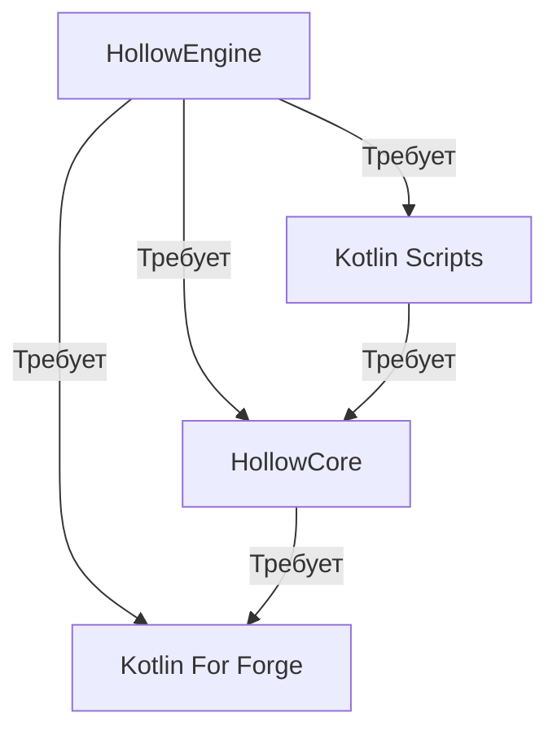

import '@site/src/css/pages/img-show.css';

# Зависимости мода `HollowEngine`

Просто установить 1 мод и думать что всё будет окей - неверное утверждение!

<link rel="preload" as="image" href="@site/static/img/doc/titles/ForgeCrush0.webp" />

")

Вам разве не показалось странным, что такой БОЛЬШОЙ мод весит как-то мало?

---

## График зависимостей

:::info Зависимости мода HollowEngine в виде графика

:::

---

:::warning по поводу `KotlinScripts`
⚠️ Скачивать нужно ***полную*** версию, без таких тегов как: [**no-compiler**, **lite**, **original**, и т.д.] ⚠️
:::

---

## Скачать зависимости

Скачать все зависимые моды вы можете здесь -> ["Скачать моды"](../../98-downloads-mods.mdx)

